# 🏨 Hotel Booking Cancellation Prediction using Machine Learning

## 📌 Project Overview
This project focuses on analyzing hotel booking data and predicting whether a booking will be canceled using Machine Learning techniques. The goal is to understand customer behavior and identify key factors affecting cancellations.

---

## 🎯 Objectives
- Analyze the dataset and understand key features  
- Perform data cleaning and preprocessing  
- Handle missing values  
- Perform exploratory data analysis (EDA)  
- Build multiple machine learning models  
- Evaluate models using accuracy, precision, recall, and F1-score  
- Identify important features influencing cancellations  
- Select the best-performing model  

---

## 📊 Dataset Information
- Total Records: ~119,000  
- Features: 30+  
- Target Variable: `is_canceled`  

---

## 🧹 Data Preprocessing
- Removed unnecessary columns (company, name, email, etc.)  
- Handled missing values using mean/mode  
- Encoded categorical variables  
- Performed train-test split (80/20)  
- Applied feature scaling  

---

# 📊 Exploratory Data Analysis (EDA)

## 🔹 Booking Cancellation Count
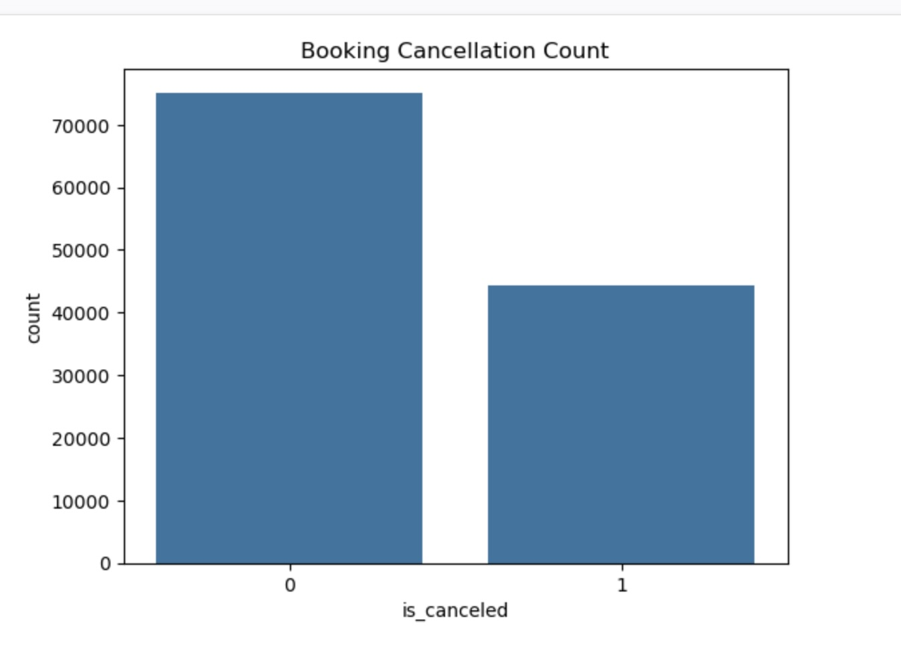

👉 More bookings are not canceled than canceled (dataset imbalance).

---

## 🔹 Hotel Type vs Cancellation
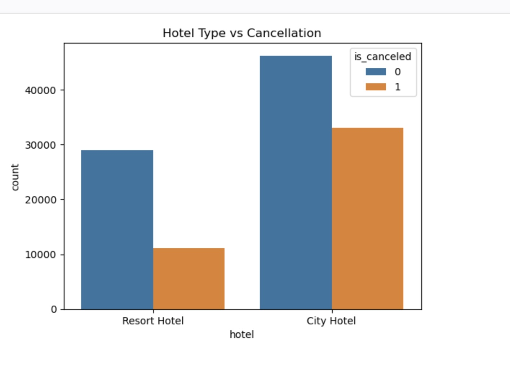

👉 City hotels have more bookings and more cancellations compared to resort hotels.

---

## 🔹 Monthly Bookings
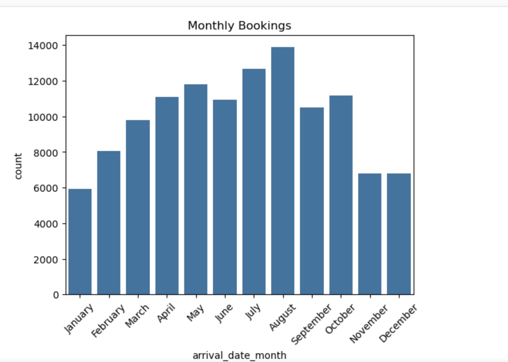

👉 Bookings peak during mid-year months, showing seasonal trends.

---

## 🔹 ADR Distribution
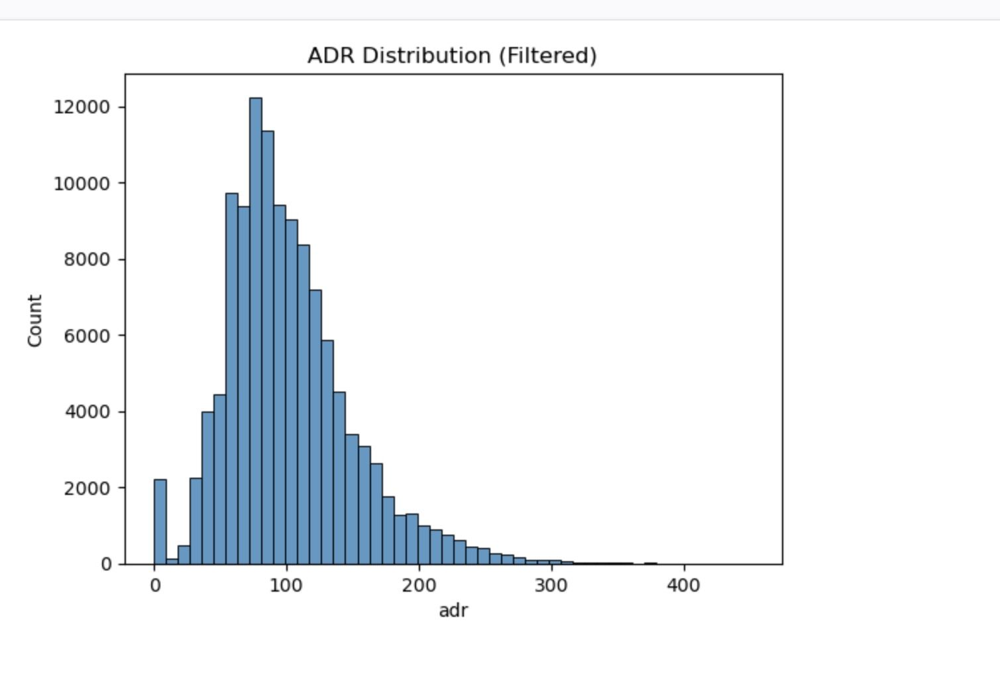

👉 ADR (price per night) is right-skewed, meaning fewer high-price bookings.

---

## 🔹 Average Lead Time vs Cancellation
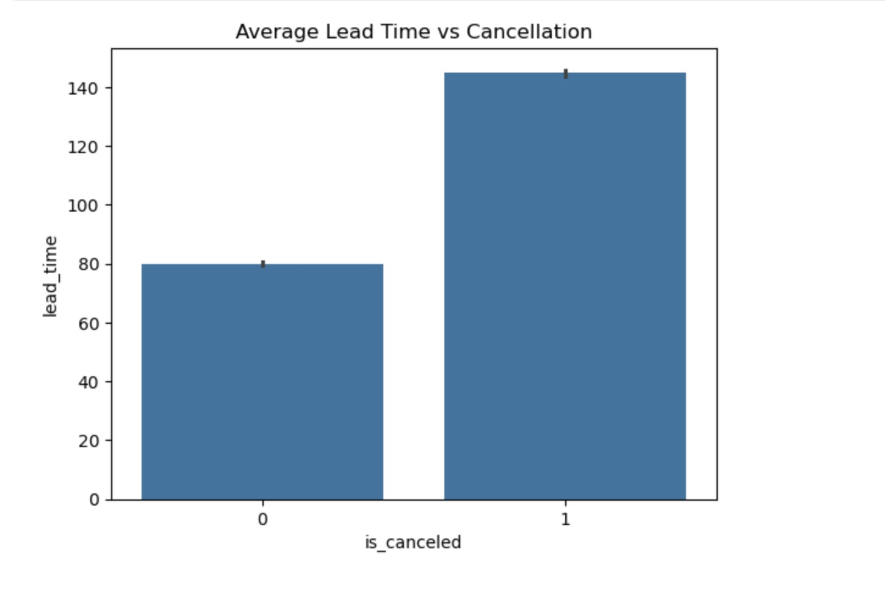

👉 Customers with higher lead time tend to cancel more.

---

## 🔹 Lead Time vs ADR
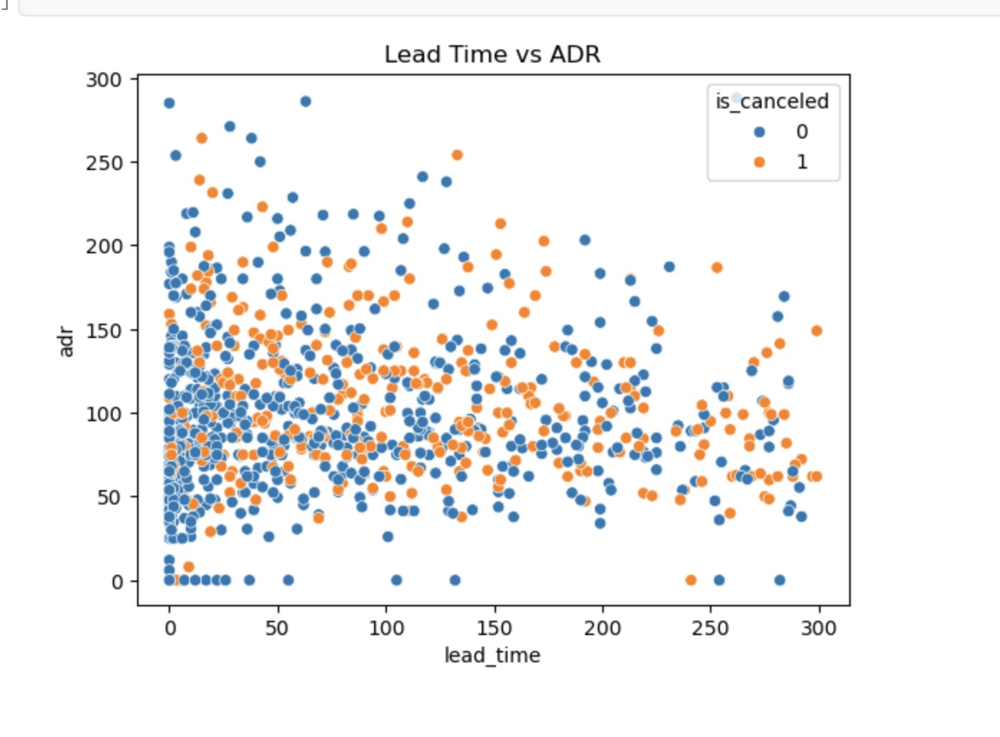

👉 No strong relationship between price and lead time; cancellations occur across all ranges.

---

# 🤖 Machine Learning Models

## 🔹 Logistic Regression
A simple linear model used for binary classification.

## 🔹 Decision Tree
A tree-based model that splits data based on feature values.

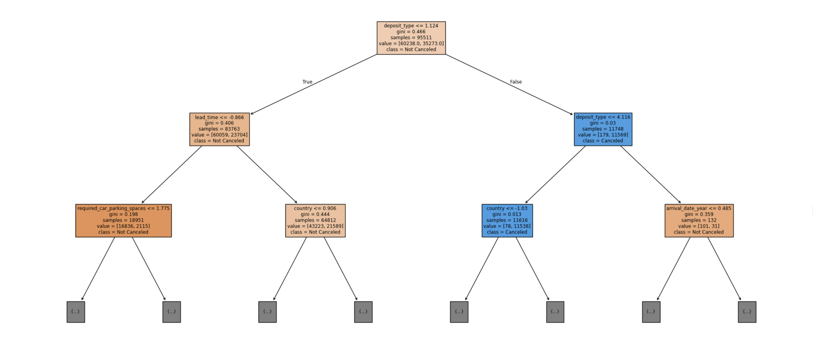

## 🔹 Random Forest
An ensemble model combining multiple decision trees for better accuracy.

## 🔹 K-Nearest Neighbors (KNN)
Classifies data based on similarity with nearest data points.

## 🔹 Naive Bayes
A probabilistic model based on Bayes' theorem.

---

# 📊 Model Performance Comparison
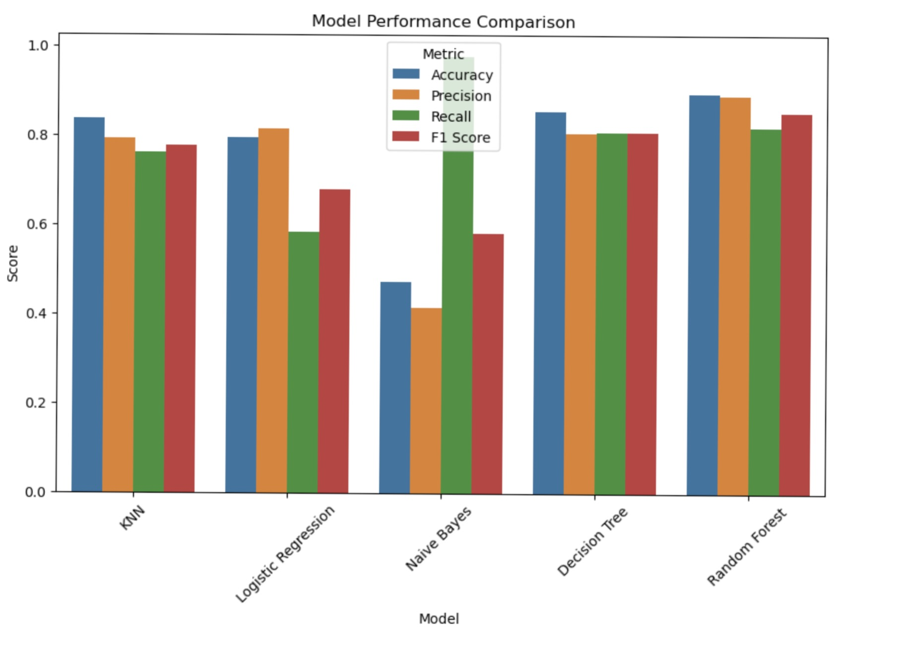

👉 Comparison of all models using evaluation metrics.

---

# 📈 Model Comparison Graph
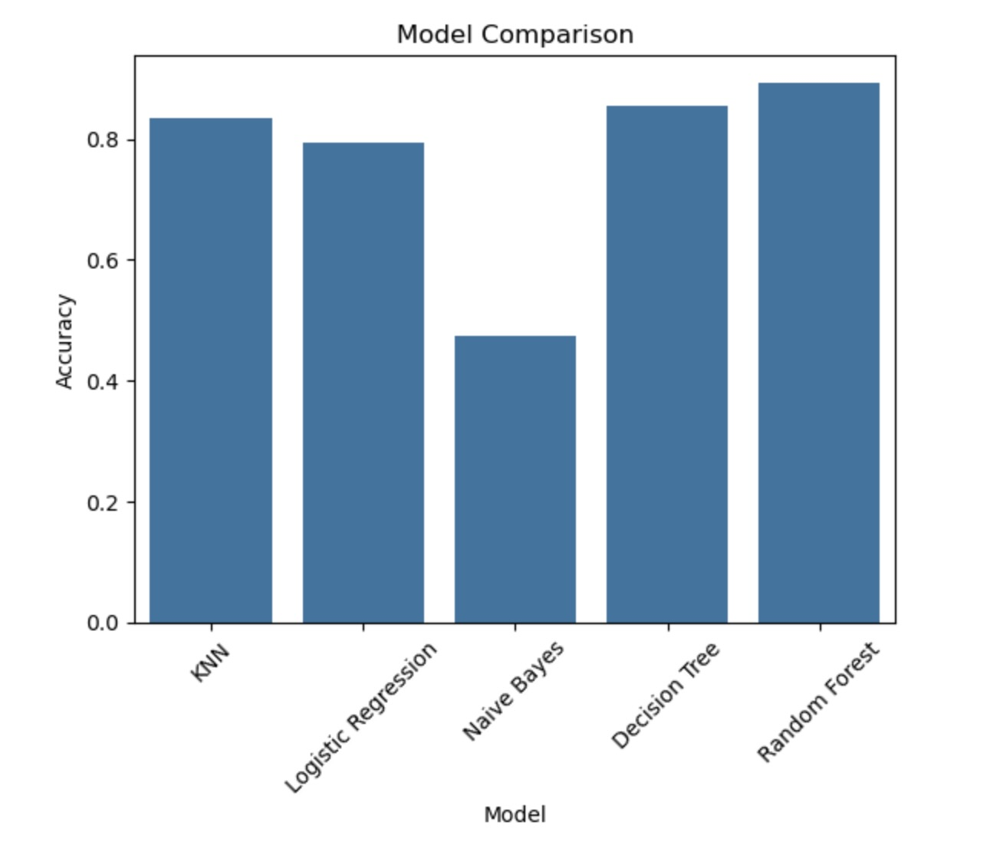

👉 Random Forest performs the best among all models.

---

# 📉 ROC Curve
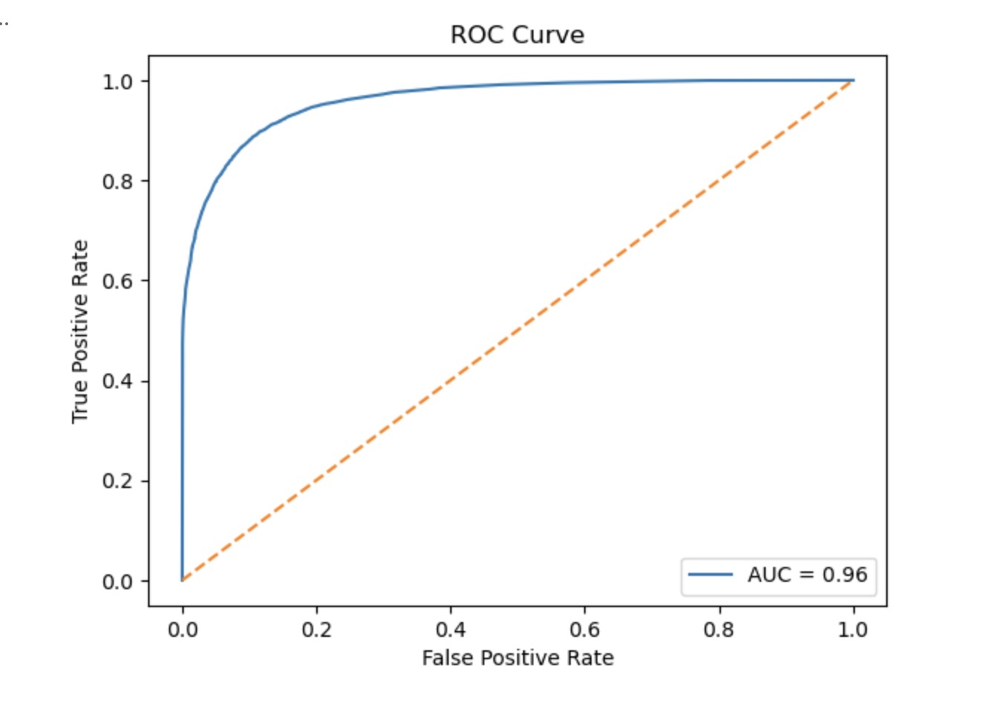

👉 AUC score close to 1 indicates strong model performance.

---

# ⭐ Feature Importance
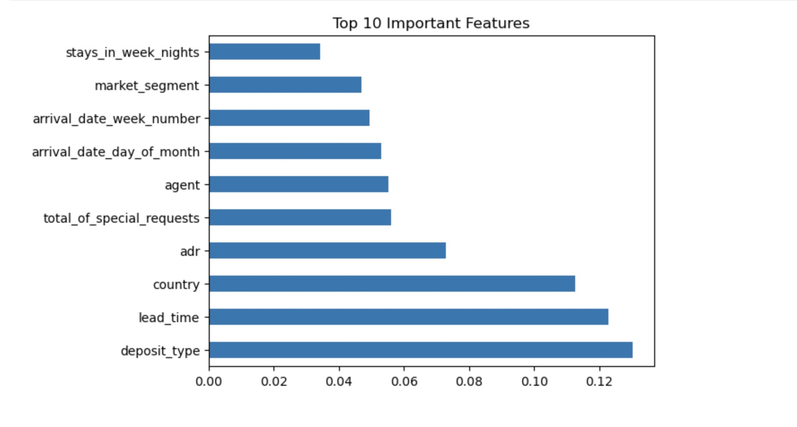

👉 Important features:
- deposit_type  
- lead_time  
- country  
- adr  

---

# 🔮 Prediction

---

# 🏆 Conclusion
- Random Forest achieved the best performance  
- Lead time and deposit type are key influencing factors  
- Model can help hotels reduce cancellations and improve planning  

---

# 🚀 Future Scope
- Apply advanced models (XGBoost, LightGBM)  
- Perform hyperparameter tuning  
- Deploy model using Flask or Streamlit  
- Build a real-time prediction system  

---

# 🛠️ Technologies Used
- Python  
- Pandas, NumPy  
- Matplotlib, Seaborn  
- Scikit-learn  

---

# 👨‍💻 Author
**Muneesh Sharma**  
M.Tech Data Science (LPU)
